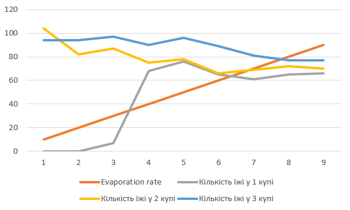
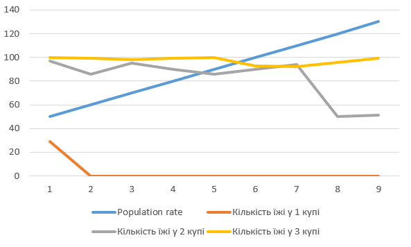
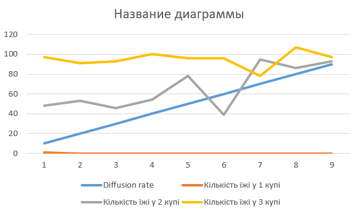

## Комп'ютерні системи імітаційного моделювання

## СПм-22-5, **Кайда Валерія Віталіївна**

### Лабораторна робота №**1**. Опис імітаційних моделей та проведення обчислювальних експериментів

 

### Варіант 10, модель у середовищі NetLogo:

[Ants](http://www.netlogoweb.org/launch#http://www.netlogoweb.org/assets/modelslib/Sample%20Models/Biology/Ants.nlogo). Модель переміщення мурах у пошуку їжі.

 

### Вербальний опис моделі:

Ця модель описує мурашину колонію, в якій мурашки шукають їжу і комунікують між собою за допомогою хімічних слідів. Основна ідея полягає в тому, що кожна мурашка дотримується простих правил, але в цілому колонія веде себе досить складно.

### Керуючі параметри:

-   **(EVAPORATION-RATE)**: Цей параметр керує швидкістю випаровування хімічного сліду, який залишають мурашки на своєму шляху.
Зменшення цього значення призведе до того, що хімічний слід буде випаровуватися повільніше, і він буде більше часу доступний для використання мурашками.
Збільшення цього значення призведе до швидкого випаровування хімічного сліду, що може ускладнити мурашкам знаходити джерела їжі.

-   **(DIFFUSION-RATE)**: Цей параметр керує швидкістю розповсюдження хімічного сліду в середовищі.
Зменшення цього значення призведе до повільнішого розповсюдження хімічного сліду, і він буде концентрованіший близько до місця, де його залишила мурашка.
Збільшення цього значення призведе до швидкого розповсюдження хімічного сліду, що може допомогти мурашкам швидше знаходити їжу.

-   **(POPULATION)**: Цей параметр дозволяє вам встановити кількість мурашок у колонії перед початком симуляції.
За допомогою цього параметра ви можете змінити густину мурашиного населення в симуляції.
Змінюючи ці параметри, ви можете експериментувати з різними умовами для мурашиного колонії і спостерігати, як це впливає на їхню поведінку та пошук їжі.

### Внутрішні параметри:

-   **(chemical)**: Кількість хімічної речовини на даному патчі. Вона використовується мурашками для навігації та комунікації.

-   **(food)**: Кількість їжі на даному патчі. Відображає кількість доступної їжі на патчі (0, 1 або 2).

-   **(nest?)**: Значення true на патчах, які представляють мурашник, і false на інших патчах.

-   **(nest-scent)**: Число, яке вище ближче до мурашника. Ця величина використовується для визначення запаху мурашника.

-   **(food-source-number)**: Номер (1, 2 або 3) для ідентифікації джерел їжі на патчах.

### Показники роботи системи:

-   Споживання їжі: Цей показник може бути відстежений за допомогою графіку або числового значення, яке вказує на кількість спожитої їжі від усіх мурах під час симуляції.

- Кількість мурах: Ви можете відстежувати загальну кількість мурах у системі, щоб переконатися, що вона не перевищує задану кількість.

- Розподіл мурах: Аналіз розподілу мурашок за їхнім станом (наприклад, кількість мурашок, які несуть їжу та ті, які повертаються в гніздо) може вказувати на рівень спеціалізації та співпраці в колонії.

- Концентрація хімічного сліду: Ви можете відстежувати концентрацію хімічного сліду на патчах та аналізувати, як вона змінюється з плином часу.
 

## Недоліки моделі

-   Спрощена поведінка: Модель базується на декількох простих правилах, які визначають поведінку мурах. В реальності поведінка мурах є гораздо складнішою та різноманітнішою, і вона може залежати від багатьох факторів, таких як вид, тип гнізда, доступні ресурси тощо.

- Спрощена модель хімічного сліду: Модель використовує спрощену версію хімічного сліду, який мурахи залишають. У реальності мурахи використовують складну комбінацію хімічних речовин для навігації та спілкування в колонії.

- Статична обстановка: У моделі обстановка (розташування гнізда і їжі) є статичною і не змінюється з часом. У реальному житті мураші зустрічають різні ситуації та змінюють свою поведінку відповідно до змін у середовищі.

- Відсутність взаємодії з іншими видами: Модель не враховує можливої взаємодії мурах з іншими видами тварин чи іншими мурашиними колоніями, що може бути важливим фактором для реальних мурах.

- Відсутність структури внутрішньої колонії: У моделі мурахи представлені як індивідуальні агенти, але в реальності колонія має ієрархію, різні кастові групи, функціональний розподіл робіт і так далі.

- Відсутність екологічних факторів: Модель не враховує екологічних аспектів, таких як конкуренція з іншими видами, природні вороги, зміни в середовищі тощо.

- Відсутність адаптивності: Модель не передбачає механізмів адаптації мурах до змін в середовищі. У реальності мурахи можуть розвивати нові стратегії та вміння відповідно до зовнішніх змін.

- Загальність: Модель є загальною та може не відображати конкретних видів мурах або враховувати індивідуальні особливості певних видів.
 

## Обчислювальні експерименти

### 1. Вплив швидкості випаровування речовини на швидкість виснаження резервів їжі

Досліджується, як змінюється кількість їжі на трьох джерелах їжі після 300 тактів, в залежності від різних швидкостей випаровування речовини. Експерименти проводяться з десятьма симуляціями, де кожна має швидкість випаровування в діапазоні від 10 до 90 з кроком 10.

Інші керуючі параметри мають наступні значення:

- population: 100 (середнє значення)
- diffusion-rate: 50 (значення за замовчуванням)

<table>
<thead>
<tr><th>Evaporation rate</th><th>Кількість їжі у 1 купі</th><th>Кількість їжі у 2 купі</th><th>Кількість їжі у 3 купі</th></tr>
</thead>
<tbody>
<tr><td>10</td><td>0</td><td>104</td><td>94</td></tr>
<tr><td>20</td><td>0</td><td>82</td><td>94</td></tr>
<tr><td>30</td><td>7</td><td>87</td><td>97</td></tr>
<tr><td>40</td><td>68</td><td>75</td><td>90</td></tr>
<tr><td>50</td><td>76</td><td>78</td><td>96</td></tr>
<tr><td>60</td><td>65</td><td>66</td><td>89</td></tr>
<tr><td>70</td><td>61</td><td>69</td><td>81</td></tr>
<tr><td>80</td><td>65</td><td>72</td><td>77</td></tr>
<tr><td>90</td><td>66</td><td>70</td><td>77</td></tr>
</tbody>
</table>

На графіку видно, що зі збільшенням швидкості випаровування, кількість їжі, що залишається в кожній з куп, також зростає. Це свідчить про те, що хімічний засіб випаровується дуже швидко, що призводить до того, що мурахи втрачають свій шлях до джерел їжі і, відповідно, збирають їжу повільніше.

### 2. Вплив популяції мурах на швидкість виснаження резервів їжі

Вивчається, як кількість їжі в різних купах змінюється після 300 тактів, в залежності від різних розмірів популяції мурах. Проводяться 9 симуляцій з різними кількостями мурах, від 50 до 130 з кроком 10.

Інші керуючі параметри мають значення за замовчуванням:

- **diffusion-rate**: 50
- **evaporation-rate**: 10

<table>
<thead>
<tr><th>Population rate</th><th>Кількість їжі у 1 купі</th><th>Кількість їжі у 2 купі</th><th>Кількість їжі у 3 купі</th></tr>
</thead>
<tbody>
<tr><td>50</td><td>29</td><td>97</td><td>100</td></tr>
<tr><td>60</td><td>0</td><td>86</td><td>99</td></tr>
<tr><td>70</td><td>0</td><td>95</td><td>98</td></tr>
<tr><td>80</td><td>0</td><td>90</td><td>99</td></tr>
<tr><td>90</td><td>0</td><td>86</td><td>100</td></tr>
<tr><td>100</td><td>0</td><td>90</td><td>93</td></tr>
<tr><td>110</td><td>0</td><td>94</td><td>92</td></tr>
<tr><td>120</td><td>0</td><td>50</td><td>96</td></tr>
<tr><td>130</td><td>0</td><td>51</td><td>99</td></tr>
</tbody>
</table>

Графік вказує на те, що зі збільшенням кількості мурах в популяції, джерело їжі поблизу споживається швидше. 

### 3. Вплив швидкості дифузії речовини на швидкість спустошення джерел їжі

Досліджується залежність кількості їжі після певної кількості тактів (300) від швидкості дифузії речовини.
Експерименти проводяться при швидкості дифузії 10 - 90, з кроком 10, усього 9 симуляцій.

Інші керуючі параметри мають наступні значення:

- **population**: 100 (середнє значення)
- **evaporation-rate**: 10 (значення за замовчуванням)

<table>
<thead>
<tr><th>Diffusion rate</th><th>Кількість їжі у 1 купі</th><th>Кількість їжі у 2 купі</th><th>Кількість їжі у 3 купі</th></tr>
</thead>
<tbody>
<tr><td>10</td><td>1</td><td>48</td><td>97</td></tr>
<tr><td>20</td><td>0</td><td>53</td><td>91</td></tr>
<tr><td>30</td><td>0</td><td>46</td><td>93</td></tr>
<tr><td>40</td><td>0</td><td>54</td><td>100</td></tr>
<tr><td>50</td><td>0</td><td>78</td><td>96</td></tr>
<tr><td>60</td><td>0</td><td>39</td><td>96</td></tr>
<tr><td>70</td><td>0</td><td>95</td><td>78</td></tr>
<tr><td>80</td><td>0</td><td>86</td><td>107</td></tr>
<tr><td>90</td><td>0</td><td>93</td><td>97</td></tr>
</tbody>
</table>

Графік вказує, що швидкість дифузії майже не впливає на швидкість спустошення джерел їжі.
